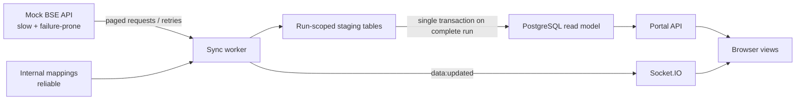

# Architecture

The important boundary is staging-to-read-model promotion. The API always queries the last successfully promoted snapshot, which makes it fast and means BSE outages or partial responses cannot make clients, trades, mappings, and incentives contradict one another. Each page is retryable and each natural key is upserted, allowing duplicate delivery and a restarted worker without duplicate trades. A production deployment would replace the in-process trigger with a durable queue and source lease to serialize promotions.
